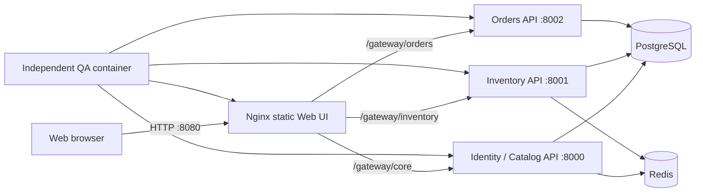

# Commerce Quality Platform

**English** | [Русский](README.ru.md)

A public, reproducible QA portfolio project built around a deliberately small microservice commerce application. The application exists to exercise realistic quality risks—not to imitate a production store—and demonstrates API, integration, contract, UI, concurrency, performance, and baseline security testing.

The repository currently contains **164 independently collected automated tests** and reproducible Docker workflows for Pytest, requests, Playwright, Schemathesis, PostgreSQL, Redis, Allure, Locust, OWASP ZAP, and GitHub Actions.

> The verified figures in this document describe one local Docker environment. They are not production SLAs, user traffic, business outcomes, or evidence of production operation.

## Architecture



Identity/Catalog, Inventory, and Orders are separate FastAPI processes. They intentionally share one PostgreSQL instance so reserve-to-order transitions can be tested atomically without claiming distributed transactions. PostgreSQL is the source of truth; Redis is a 10-minute idempotency cache with a tested database fallback.

## What this project demonstrates

| Skill | Implementation | Evidence |
|---|---|---|
| Python, Pytest, requests | Independent API and integration suites with isolated fixtures | 120 regression and 7 smoke tests |
| API testing | Positive, negative, validation, pagination, error, and idempotency scenarios | `qa/api/` and PostgreSQL cross-checks |
| JWT and RBAC | Registration, Argon2 passwords, HS256 access tokens, customer/admin matrix | Missing, malformed, expired, inactive, foreign-user, and role tests |
| PostgreSQL and Redis | Direct persistence checks, constraints, cache verification and fallback | API ↔ database ↔ cache integration tests |
| Concurrency | Conditional SQL updates, row/advisory locks, idempotent replay | Oversell and duplicate-order race tests |
| OpenAPI and Schemathesis | Property-based checks for all 27 documented operations | 27 contract tests, up to 10 Hypothesis examples each |
| Playwright | Critical sign-in → reserve → order flow | 10 scenarios in Chromium, Firefox, and WebKit |
| Allure | Suite hierarchy, environment metadata, failure details | Reproducible combined HTML report |
| Locust | 70% read / 30% checkout-and-cancel workload | HTML, CSV, JSON, guardrails and cleanup |
| OWASP ZAP | Passive Web baseline and three safe OpenAPI scans | Per-target HTML, JSON, Markdown and explicit triage |
| GitHub Actions | Isolated parallel suites and manual non-functional jobs | Statically validated workflows; no external run claimed |

## Quick start

Requirements: Docker with Docker Compose and available host ports `8000`, `8001`, `8002`, and `8080`.

```bash
docker compose up -d --build --wait

curl http://localhost:8000/health
curl http://localhost:8001/health
curl http://localhost:8002/health
curl http://localhost:8080/health
```

The storefront is available at `http://localhost:8080`; OpenAPI documents are available at:

- `http://localhost:8000/openapi.json` — Identity and Catalog;
- `http://localhost:8001/openapi.json` — Inventory;
- `http://localhost:8002/openapi.json` — Orders.

Host ports can be changed without changing service-to-service URLs:

```bash
CORE_PORT=18000 INVENTORY_PORT=18001 ORDERS_PORT=18002 WEB_PORT=18080 \
  docker compose up -d --build --wait
```

Stop the stack while preserving PostgreSQL data:

```bash
docker compose down
```

## Test strategy

| Suite | Collected tests | Purpose |
|---|---:|---|
| `smoke` | 7 | Service health and critical availability |
| `regression` | 120 | API, integration, RBAC, storage, and concurrency behavior |
| `contract` | 27 | OpenAPI/property-based conformance and absence of 5xx |
| `ui` | 10 | Critical browser path, errors, mobile layout, keyboard access |
| **Total source tests** | **164** | Browser matrix executions are not counted as new tests |

Run the complete Chromium suite or an individual marker:

```bash
docker compose --profile qa run --rm --build qa pytest -q --browser chromium
docker compose --profile qa run --rm qa pytest -q -m smoke --browser chromium
docker compose --profile qa run --rm qa pytest -q -m regression --browser chromium
docker compose --profile qa run --rm qa pytest -q -m contract --browser chromium
docker compose --profile qa run --rm qa pytest -q -m ui --browser chromium
docker compose --profile qa run --rm qa pytest --collect-only -q --browser chromium
```

Run UI tests with retained failure artifacts:

```bash
docker compose --profile qa run --rm qa pytest -q -m ui \
  --browser firefox \
  --tracing retain-on-failure --video retain-on-failure \
  --screenshot only-on-failure --output test-results/firefox
```

## Main behavior under test

### Identity and Catalog

- Public customer registration always creates the `customer` role.
- Passwords are hashed with Argon2; 15-minute JWT access tokens contain `sub`, `role`, `iat`, and `exp`.
- Catalog reads are public; category and product mutations require `admin`.
- Duplicate, malformed, unauthorized, forbidden, unknown-resource, and relationship-conflict cases have stable HTTP responses.

The Compose credentials below are explicit local demonstration values, not secrets suitable for deployment:

```text
email: admin@example.com
password: LocalAdmin123!
JWT secret: local-demo-secret-not-for-production
```

### Inventory and Orders

- Reserve uses an atomic conditional PostgreSQL update and cannot produce negative stock.
- `(user_id, idempotency_key)` is unique; concurrent replay returns one reservation.
- Redis accelerates replay but PostgreSQL remains the safe fallback.
- Order creation commits an active reservation and snapshots its price in one transaction.
- Repeated or concurrent order requests do not create duplicate orders.
- Cancellation is idempotent and restores available stock exactly once.

Automatic reservation expiry, payments, delivery, refresh tokens, email verification, password recovery, and rate limiting are intentionally out of scope.

## Allure reporting

Generate raw results and the pinned Allure Report 2.46.1 HTML without installing Java or Allure on the host:

```bash
docker compose --profile qa run --rm qa pytest -q -m smoke \
  --alluredir=allure-results/smoke
docker compose --profile report run --rm --build allure-report \
  generate /allure-results --output /allure-report --clean
```

Open `allure-report/index.html`. Raw results, HTML reports, and Playwright failure artifacts are Git-ignored.

## Locust performance profile

The pinned `locustio/locust:2.46.5` profile creates a dedicated `LOAD-<run-id>` category, product, and large stock, then removes all generated users, orders, reservations, inventory rows, catalog rows, and Redis keys.

```bash
docker compose run --rm --build \
  -e LOAD_RUN_ID=main-local -e RESULTS_DIR=/results/main \
  locust -f /mnt/locust/locustfile.py --headless \
  -u 20 -r 5 -t 2m --csv /results/main/stats --csv-full-history \
  --html /results/main/report.html --only-summary

# Idempotent recovery after an interrupted run
docker compose run --rm --build load-cleanup
```

Local guardrails are failure ratio ≤1%, aggregate p95 ≤1500 ms, read-only p95 ≤1000 ms, at least 500 requests, no HTTP 5xx, and no Locust exceptions. Reports are written to `performance-results/`.

## OWASP ZAP DAST

The pinned `zaproxy/zap-stable:2.17.0` image runs only passive Web baseline and safe OpenAPI mode. Active scan, authenticated DAST, exploitation, and external targets are excluded.

```bash
docker compose run --rm zap-web
docker compose run --rm zap-api
docker compose run --rm zap-api zap-api-scan.py \
  -t http://inventory-api:8001/openapi.json -f openapi -S \
  -c /zap/config/zap-api.conf \
  -r inventory-api.html -J inventory-api.json -w inventory-api.md -I
docker compose run --rm zap-api zap-api-scan.py \
  -t http://orders-api:8002/openapi.json -f openapi -S \
  -c /zap/config/zap-api.conf \
  -r orders-api.html -J orders-api.json -w orders-api.md -I
docker compose run --rm zap-check \
  security-results/web.json security-results/core-api.json \
  security-results/inventory-api.json security-results/orders-api.json
```

Every target produces HTML, JSON, and Markdown. Unclassified Medium/High alerts, technical failures, unavailable targets, and HTTP 5xx fail the check. Low alerts remain visible as warnings. The Web anti-CSRF finding is retained with a rule-specific rationale: authentication uses a bearer token in `sessionStorage`, not a cookie-authenticated session.

## One-command final audit

The audit uses a fresh Compose project, isolated PostgreSQL volume, and host ports `18000/18001/18002/18080`. It rebuilds project images without cache, runs every suite, creates Allure/Locust/ZAP artifacts, verifies database and Redis cleanup, and always removes the audit volume.

It intentionally requires an explicit destructive flag and a clean Git working tree:

```bash
scripts/final-audit.sh --clean-artifacts
```

Only the Git-ignored `allure-results/`, `allure-report/`, `test-results/`, `performance-results/`, and `security-results/` directories are cleaned.

## Continuous integration

- `.github/workflows/qa.yml` runs smoke, regression, contract, and the Chromium/Firefox/WebKit UI matrix on pushes and pull requests to `main`.
- `.github/workflows/nonfunctional.yml` is manual-only and runs performance and DAST jobs in separate Compose projects.
- Jobs use read-only permissions, no secrets, no deployment, no GitHub Pages, and 14-day artifacts.
- Both workflows pass local `actionlint 1.7.12` validation.

This repository has not been published and has no Git remote, so no successful GitHub Actions execution is claimed.

## Verified local results

Last verified on **2026-10-05** before the final clean audit:

- collection: `164 tests`;
- smoke: `7 passed`; regression: `120 passed`; contract: `27 passed`;
- UI: `10 passed` in each of Chromium, Firefox, and WebKit;
- two complete Chromium runs: `164 passed` each;
- combined Allure report: `184 passed` executions (164 source tests; 10 UI tests repeated across three browsers);
- Locust 20 users / 5 users/s / 2 min: 24,966 requests, 208.38446412384073 RPS, 0.0 failure ratio, 2 ms median, 7 ms aggregate p95, 4 ms read-only p95;
- ZAP triage: 0 blocking alerts, 3 warnings, 11 informational alerts;
- six healthy services and no residual test/load data or Redis idempotency keys.

These values will naturally vary between machines. The raw ignored artifacts are the source of truth for a new run.

## Repository structure

```text
app/                 Identity/Catalog API and shared models
inventory_service/   Inventory and reservation API
orders_service/      Order lifecycle API
web/                 Static storefront and Nginx gateway
migrations/          Alembic database migrations
qa/api/              HTTP API tests
qa/integration/      PostgreSQL, Redis, and concurrency tests
qa/contract/         Schemathesis property-based tests
qa/ui/               Cross-browser Playwright tests
qa/load/             Locust workload and cleanup
qa/security/         ZAP policy and report checker
scripts/             Allure and final-audit tooling
```

Long-term project requirements, implementation stages, and verified history are recorded in [SPEC.md](SPEC.md), [PLAN.md](PLAN.md), and [STATUS.md](STATUS.md).

## Limitations

- This is a local learning and portfolio stand, not a production service.
- It has no measured availability, production traffic, customers, or business impact.
- Services share PostgreSQL; distributed transactions and independent service databases are not claimed.
- OpenAPI does not yet enumerate every domain-specific 401/403/404/409 response, so Schemathesis `status_code_conformance` is explicitly deferred.
- Unknown query parameters are ignored by the current FastAPI application and treated accordingly by contract generation.
- DAST is passive/safe and unauthenticated; it is not a penetration test.
- Performance thresholds are local stability guardrails, not capacity claims.
- GitHub Actions configuration is statically validated but not externally executed.

## License

Released under the [MIT License](LICENSE).
